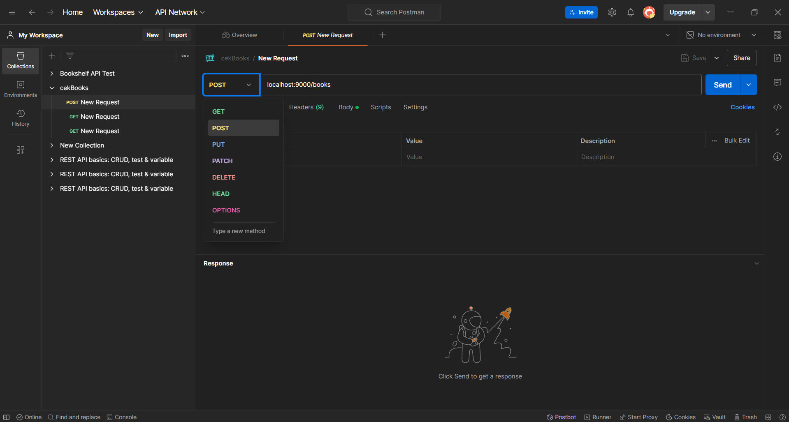

# Notes-App-Basic

Merupakan Aplikasi Notes App Back-end sederhana ini digunakan untuk melakukan pembelajaran dasar tentang backend dengan
menggunakan library hipo bukan menggunakan express.

## Fitur

- [ ] Melakukan Prosess CRUD
- [ ] Filtering Data
- [ ] Menggunakan Data json


## Teting
Aplikasi dapat di testing dengan menggunakan postman. testing dilakukan untuk menguji apakah RestAPI yang kita buat sudah baik dan benar.
dengan melakukan fitur. request yang digunakan adalah GET, POST, PUT, DELETE.



## Instalasi

Instruksi untuk menginstal dan menjalankan proyek ini secara lokal.

```bash
git clone https://github.com/username/repository-name.git
cd repository-name
npm install
npm start

